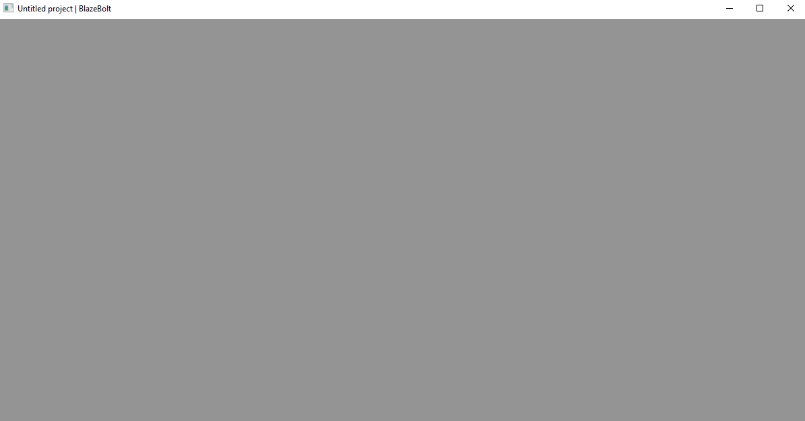
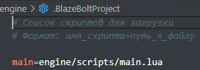

# BlazeBolt Game Engine 1.0

Лёгкий и оптимизированный игровой движок на C++ с поддержкой Lua-скриптинга.

---

## Сборка движка

### Через Python

```bash
python build.py
```

Скрипт автоматически скомпилирует движок под вашу систему (Windows/Linux). Результат — в папке `./bin/`.

### Через CMake

```bash
mkdir bin
cd bin
cmake ..
make            # или mingw32-make
```

После сборки в `./bin/` появится `game.exe` (Windows) или `game` (Linux).

---

## Идеология

1. **Минимальный вес** и **максимальная оптимизация** — движок работает практически на любом оборудовании.
2. Игры должны получаться **ультралёгкими** по весу и **атмосферными** по геймплею.

---

## Планы развития

### Интерфейс
- [ ] Редактор с хабом как игра на движке
- [ ] Шаблоны проектов
- [ ] Blueprint-система

### Конструкционные
- [ ] Нодовая система
- [ ] Новые субъекты: `Node2D`, `Script`

### Логические
- [ ] C# как вариант скриптов
- [ ] Python для создания модов
- [ ] Компиляция проектов в `luac`

---

## Документация

Полная документация по Lua API находится в папке `./documentationcs/`.
Также доступна на сайте: https://exeboiulight.github.io/MirulitSoftware-web/ (кнопка «?» внизу).

---

## Для контрибьюторов

### Правила

- Если добавили новые функции, связанные с **Lua API** — обязательно дополните документацию.
- При создании новой фишки движка напишите в наш Discord-сервер и опишите изменения.
- Если ваша команда хочет использовать движок — берите на здоровье, только укажите студию и авторов как соавторов проекта.

---

## О движке

Движок разрабатывался для нужд инди-студии **Mirulit Software**. Изначально код был закрыт, но теперь мы работаем с сообществом.

**Благодарности:**
- **OxygenSE** — за первоначальную и ключевую оптимизацию движка
- **Yellow Cat** — за иконку движка

---

## Скриншоты

**Первоначальное окно**


**Скрипт с настройками проекта**

